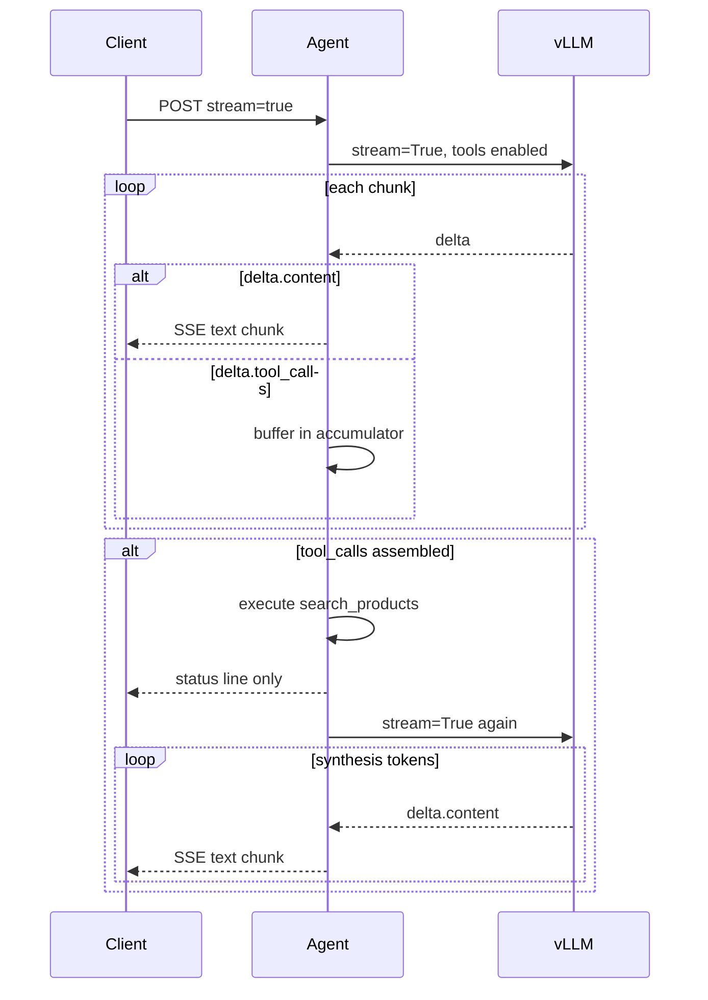

# Agent streaming architecture

How Saulie streams tokens to clients (`stream: true`) while keeping tool calls internal.

## Two API paths

| Client request | Agent path | vLLM | User sees |
|----------------|------------|------|-----------|
| `stream: true` | `_stream_agent_sse_inner` → `_stream_vllm_turn` | `stream=True` per turn | Token-by-token SSE + status lines during RAG |
| `stream: false` | `agent_loop` → `_llm_once` | `stream=False` | Single JSON blob at end (used by latency benchmarks) |

Clients like [`remote_chat.py`](remote_chat.py) use `stream=True` and need no changes.

## What gets streamed vs buffered

**Rule:** Stream all **text** (`delta.content`). Never stream **tool metadata** (`delta.tool_calls`).

We do not guess ahead of time whether a turn will be a tool call or a normal reply. vLLM tags each streaming chunk by type; the agent routes on that type as chunks arrive.



## How we tell tool output from normal text

OpenAI-compatible streaming sends **separate fields** on each chunk:

```json
{"choices": [{"delta": {"content": "Hey"}}]}
{"choices": [{"delta": {"content": " there"}}]}
{"choices": [{"delta": {"tool_calls": [{"index": 0, "function": {"name": "search_products", "arguments": "{\""}}]}}]}}
```

Implementation in [`agent_chat_api.py`](agent_chat_api.py) (`_stream_vllm_turn`):

1. **`delta.content`** → append to reply, immediately emit `_sse_content_chunk` to the client.
2. **`delta.tool_calls`** → append fragments via `_accumulate_tool_calls` (never forwarded to client).
3. **Stream end** → `_reconstruct_tool_calls` builds complete tool objects.
4. **If `tool_call_count > 0`** → run RAG, emit user-visible status (`searching for products...`), loop for synthesis turn.
5. **If `tool_call_count == 0`** → turn is complete; text was already streamed.

### Same turn, both types

The model may emit **text then tools** in one turn (e.g. performative “let me look…” then `search_products`). The user sees the text stream in real time, then a status line during search — not the tool JSON.

Tool-only turns (camping turn 6) often have **zero** `delta.content` chunks; the user only sees the status line until the **next** turn streams the product pitch.

## Transport

- **SSE** over HTTP (`text/event-stream`), OpenAI chunk format.
- **nginx** [`nginx.conf`](nginx/nginx.conf): `proxy_buffering off`, long timeouts.
- **WebSockets:** not used; SSE matches OpenAI SDK and existing infra.

## Validation

vLLM `stream=True` + tools validated on Qwen3-4B FP8 + hermes parser (probe + camping turn 6). See comment above `_stream_vllm_turn` in `agent_chat_api.py`.

Quick manual check:

```bash
curl -N -X POST http://127.0.0.1:9000/v1/chat/completions \
  -H 'Content-Type: application/json' \
  -d '{"model":"dpo-v15-trial-4","messages":[{"role":"user","content":"hello"}],"stream":true}'
```

Expect many `data: {... "delta": {"content": ...}}` lines, not one large chunk.

## Related docs

- [`MODEL_PROMPT_MATRIX_COMPARISON.md`](MODEL_PROMPT_MATRIX_COMPARISON.md) — tool reliability, performative search
- [`dpo/eval/LATENCY_REPORT.md`](dpo/eval/LATENCY_REPORT.md) — E2E timings (non-stream path)
